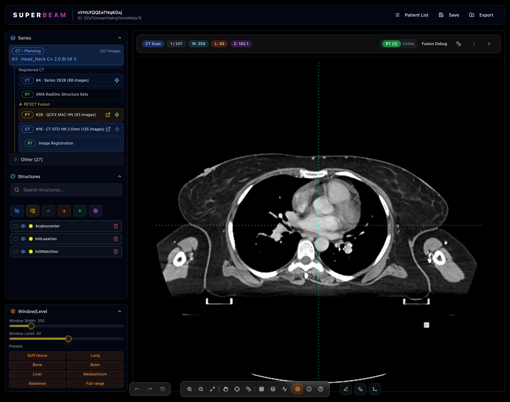
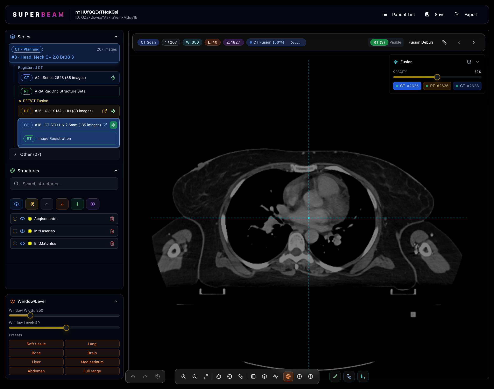
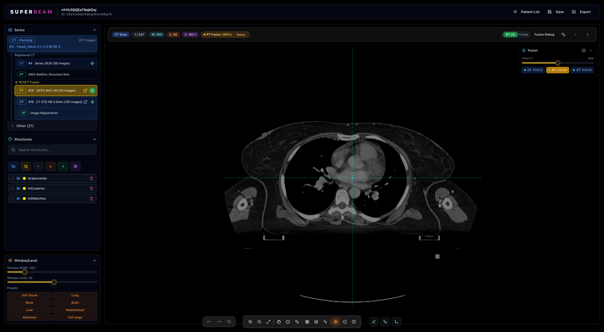
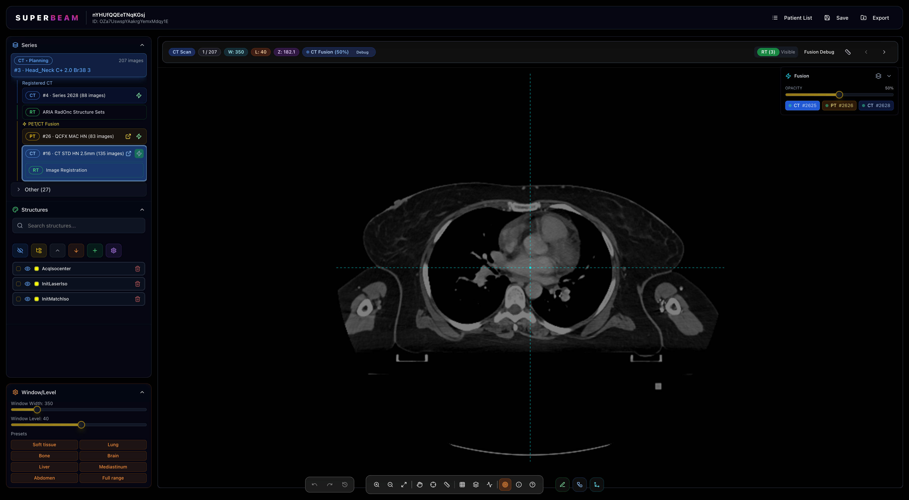
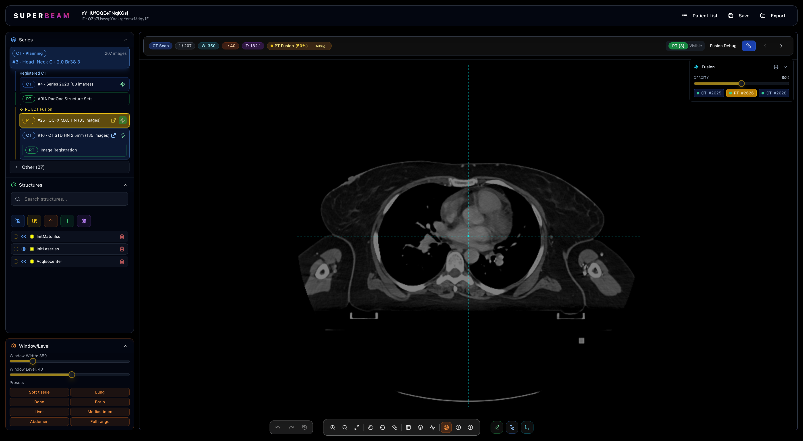
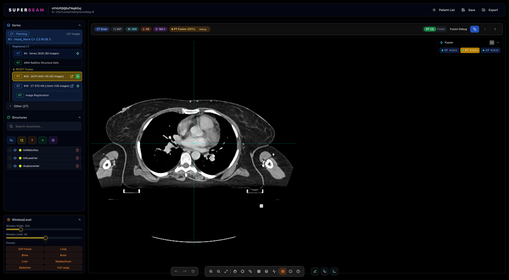

# SUPERBEAM - Advanced Medical Imaging Platform

## Revolutionary DICOM Viewer for Radiation Oncology

SUPERBEAM is a cutting-edge medical imaging platform designed specifically for radiation oncology professionals. Built with modern web technologies, it delivers enterprise-grade DICOM viewing, advanced fusion capabilities, and intelligent contouring tools—all in your browser.

---

## 🎯 Key Features

### 1. Intuitive Patient Management

**Smart Patient Organization**
- Clean, card-based patient interface
- Quick search across patients, studies, and modalities
- At-a-glance view of patient demographics and study information
- Organized display of series counts by modality (CT, PT, RT Structures)
- Recently opened, favorites, and recently imported lists for quick access

**Key Benefits:**
- Reduce time spent searching for patient data
- Streamlined workflow from patient selection to image viewing
- Clear visual hierarchy for easy navigation

---

### 2. Comprehensive Series Management

**Advanced Series Organization**
- Intelligent grouping by modality and purpose
- Automatic detection of planning vs. verification scans
- Clear indication of registered series and fusion possibilities
- One-click access to RT Structures and registration information
- Image count and series metadata at a glance

**Workflow Advantages:**
- Quickly identify which series can be fused
- Understand study relationships at a glance
- Efficient navigation between related series

---

### 3. Professional-Grade DICOM Viewer

**Clinical-Quality Image Display**
- High-performance WebGL-based rendering
- Full Window/Level control with clinical presets
- Real-time image navigation with precise slice positioning
- RT Structure overlay with customizable visibility
- Comprehensive toolbar with all essential viewing tools

**Clinical Presets Include:**
- Soft Tissue (W:350, L:40)
- Lung
- Bone
- Brain
- Liver
- Mediastinum
- Abdomen
- Full Range

---

### 4. Multi-Modality Fusion

**Intelligent Image Registration**
- Automatic DICOM registration matrix detection
- Real-time fusion overlay with adjustable opacity
- Support for CT-CT, PET-CT, and MRI fusion
- Accurate spatial alignment using DICOM coordinate systems
- Seamless switching between overlay and side-by-side views

**Technical Excellence:**
- Uses DICOM REG (Image Registration) metadata
- Robust fallback strategies for missing registration data
- Sub-millimeter precision alignment
- Background loading keeps viewer interactive

---

### 5. PET/CT Fusion

**Advanced Molecular Imaging Integration**
- One-click PET fusion activation
- Hotspot visualization with adjustable opacity
- Synchronized scrolling and navigation
- Multiple fusion series support
- Independent window/level controls for each modality

**Clinical Applications:**
- Target volume delineation for radiation therapy
- Treatment response assessment
- Improved tumor boundary visualization
- Enhanced diagnostic confidence

---

### 6. Full-Interface Fusion View

**Comprehensive Workspace Layout**
- Left sidebar: Series selection and organization
- Center: High-resolution image viewer
- Right panel: Structures, Window/Level, and tools
- Fusion controls: Quick-access opacity slider and mode switcher
- Status indicators: Slice position, window/level values, fusion status

**Efficiency Features:**
- All controls within easy reach
- No need to switch between screens
- Real-time updates across all panels
- Collapsible sections for maximum viewing area

---

### 7. Multi-Planar Reconstruction (MPR)

**3D Volume Visualization**
- Simultaneous axial, sagittal, and coronal views
- Synchronized crosshair navigation
- Real-time reformatting
- Consistent window/level across all planes
- Perfect for understanding 3D anatomy and structure extent

**Clinical Benefits:**
- Better visualization of structures in non-axial planes
- Improved understanding of spatial relationships
- Enhanced target volume delineation
- Quality assurance of contouring

---

### 8. Precision Measurement Tools

**Clinical Measurement Suite**
- Distance measurements with mm precision
- Angle measurements
- Region of interest (ROI) analysis
- Hounsfield Unit (HU) sampling
- Export measurements for documentation

**Accuracy Features:**
- Real-world coordinate system
- Calibrated using DICOM pixel spacing
- Multi-slice measurements
- Persistent annotations

---

### 9. AI-Powered Structure Localization

**Intelligent Navigation**
- Automatic detection of structure extents
- Jump to first/last slice of any structure
- Find centroid of structures
- Identify maximum structure dimensions
- Quick navigation to slices with most structure overlap

**Time-Saving Benefits:**
- Instantly locate anatomical structures
- Reduce manual scrolling time
- Improve consistency in structure review
- Enhanced quality assurance workflow

---

### 10. Side-by-Side Comparison

**Dual-Panel Fusion Display**
- Split-screen comparison mode
- Independent navigation or synchronized scrolling
- Perfect for comparing pre/post-treatment scans
- Quick switching between overlay and side-by-side modes
- Optimal for radiation oncology peer review

**Clinical Scenarios:**
- Treatment planning vs. verification CT comparison
- Pre/post-radiation anatomical changes
- Multi-timepoint PET comparison
- Deformable registration validation

---

## 🛠️ Advanced Tools

### Contouring and Segmentation
- **Smart Brush Tool**: AI-assisted contouring with intelligent edge detection
- **Boolean Operations**: Union, intersection, subtraction for structure manipulation
- **Margin Operations**: Uniform and anisotropic margin expansion
- **Prediction**: Machine learning-powered auto-contouring with slice-to-slice propagation
- **Undo/Redo**: Complete edit history with unlimited undo
- **Structure Management**: Create, edit, duplicate, and delete RT structures

### Image Manipulation
- **Zoom**: Multiple levels with sub-pixel interpolation
- **Pan**: Smooth image navigation
- **Rotate**: Arbitrary angle rotation
- **Flip**: Horizontal/vertical mirroring
- **Crosshairs**: Synchronized positioning across views
- **Fit to Window**: Automatic optimal zoom

### Data Management
- **Import/Export**: DICOM Send/Receive, file import, export to RTSTRUCT
- **Save**: Real-time auto-save with manual save option
- **PACS Integration**: Query/retrieve from DICOM servers
- **Metadata Viewer**: Full DICOM tag inspection

---

## 💡 Technology Highlights

### Modern Web Architecture
- **Built with React + TypeScript** for type safety and maintainability
- **WebGL rendering** for hardware-accelerated performance
- **Web Workers** for background processing without UI blocking
- **Progressive Web App (PWA)** capabilities for offline use

### Medical Imaging Standards
- **Full DICOM support**: CT, PT, MR, RT Structures, RT Plans, RT Dose
- **Image Registration (REG)** for accurate fusion
- **Spatial Registration** using DICOM coordinate systems
- **Frame of Reference (FOR)** validation

### Performance Optimizations
- **Background loading**: Viewer remains interactive during image loading
- **Efficient caching**: Reduces network overhead
- **Lazy rendering**: Only renders visible slices
- **Progressive loading**: Show images as they arrive

### Security & Compliance
- **HIPAA-ready architecture**
- **Client-side processing** for data privacy
- **Secure DICOM communication** (HTTPS/TLS)
- **Audit logging** capabilities

---

## 🚀 Use Cases

### Radiation Oncology
- Treatment planning
- Target volume delineation
- Organ at risk contouring
- Plan review and QA
- Peer review conferences
- Patient education

### Diagnostic Radiology
- Multi-modality image comparison
- Follow-up examination comparison
- Tumor response assessment
- Surgical planning

### Research
- Clinical trials data review
- Algorithm validation
- Image analysis workflows
- Multi-institutional studies

---

## 📊 Performance Metrics

- **Image Loading**: < 2 seconds for typical CT series (100-200 slices)
- **Fusion Initialization**: < 3 seconds for complex multi-modality fusion
- **Real-time Rendering**: 60 FPS smooth navigation
- **Memory Efficiency**: Optimized for viewing large datasets
- **Browser Compatibility**: Chrome, Firefox, Safari, Edge

---

## 🎓 Training & Support

### User-Friendly Design
- Intuitive interface requiring minimal training
- Tooltips and inline help throughout
- Keyboard shortcuts for power users
- Responsive design works on tablets

### Documentation
- Comprehensive user manual
- Video tutorials
- Interactive guides
- API documentation for integrations

---

## 🌟 What Sets SUPERBEAM Apart

1. **No Installation Required**: Pure web application—access from anywhere
2. **Modern Architecture**: Built with cutting-edge technologies for future-proof development
3. **Clinical Focus**: Designed by and for radiation oncology professionals
4. **Open Integration**: Standards-based approach works with existing PACS and TPS
5. **Continuous Innovation**: Regular updates with new features and improvements
6. **Performance**: Desktop-class performance in a web browser
7. **Cost-Effective**: No expensive hardware requirements

---

## 📧 Get Started

SUPERBEAM represents the next generation of medical imaging software—combining clinical excellence with modern technology to deliver an unparalleled user experience.

**Ready to transform your radiation oncology workflow?**

Contact us to schedule a demonstration or request a trial license.

---

*Screenshots captured from actual SUPERBEAM interface displaying clinical patient data (patient ID: nYHUfQQEeTNqKGsj)*

**Technical Stack**: React 18, TypeScript, Vite, WebGL, Web Workers, IndexedDB
**Medical Standards**: DICOM, HL7, FHIR-ready
**Deployment**: Cloud-ready, on-premise, or hybrid options available

---

© 2025 SUPERBEAM Medical Imaging Platform. All rights reserved.

